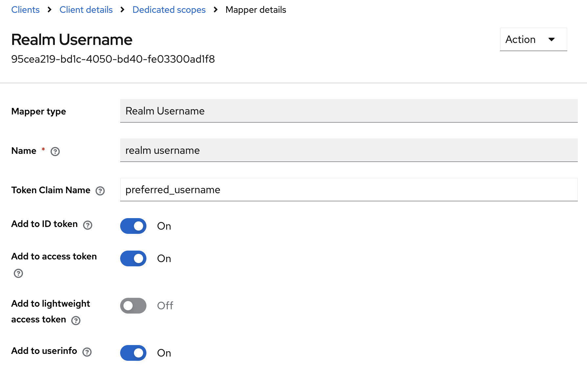

# Keycloak Extensions

## General

These custom extensions are based on

### Building the Binaries

You can build the binaries, if you have a local installation of JDK, with

    $ ./mvnw clean package

If you don't have local JDK installation, but Docker is available, you can use the helper script

    $ ./build-with-docker.sh

Both approaches will build the binary `target/keycloak-extensions.jar`.

### Deployment

Deploy the built JAR file into the `$KEYCLOAK_HOME/providers` folder of your Keycloak server (or copy it to your Docker image).

When running Keycloak in `optimized` mode, you'll have to run a `build` after deploying the JAR.
If you start Keycloak regularly, an implicit build will be performed.
See [Keycloak Docs](https://www.keycloak.org/docs) and [Keycloak Guides](https://www.keycloak.org/guides) for more info.

## Extensions

### Realm-Username Protocol Token Mapper

This OIDC protocol token mapper maps the username with a realm-name extension in the format

    username_realmname

to a claim of the token(s).  
The claim name can be configured, default value is `preferred_username`.

This mapper has a higher priority value than the regular username mapper, so this mapper will always supersede the default mapper value.

If you need this special username format in just one or some clients, you can add the mapper as a dedicated mapper in each client:

`Client` ➡ `Client scopes` ➡ `<clientId>-dedicated` ➡ `Mappers`

If you want this username format to occur for all of your clients, just add it to the default _Client Scope_ `profile` as an additional mapper.
